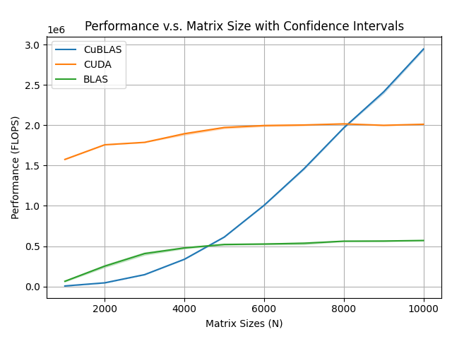
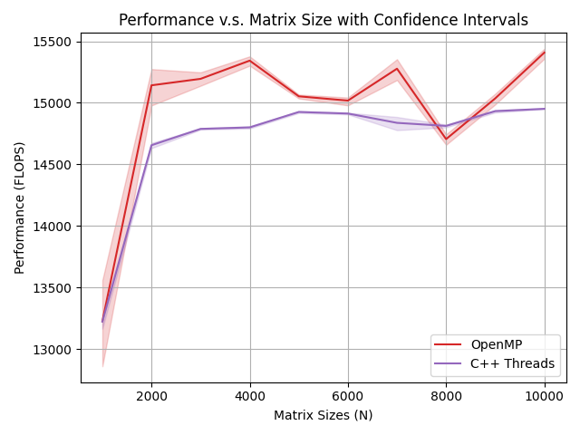
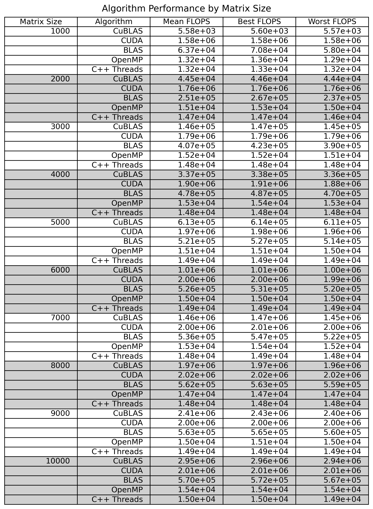

# General Matrix Multiplication (GEMM)

## Installation

```bash
# Download
wget https://github.com/OpenMathLib/OpenBLAS/archive/refs/tags/v0.3.29.tar.gz
tar -xvzf v0.3.29.tar.gz
cd OpenBLAS-0.3.29

# Install
make -j$(nproc) USE_OPENMP=1
make PREFIX=~/openblas install
```

## Compile & Execute One Test

```bash
./compile.sh <matrix-size>
./main
./mainCuda
```

## Compile & Execute All Tests

```bash
./execute.sh
```

## Sample Results

Plotted are sample means with confidence intervals of FLOPS that were calculated from 30 runtimes for each algorithm and matrix size pair and resampled 10,000 times with replacement using bootstrapping.






